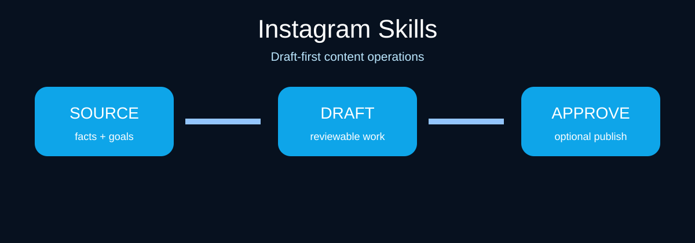

# Instagram Skills for Claude Code and Codex

[](.claude-plugin/plugin.json)
[](.codex-plugin/plugin.json)
[](SKILL.md)
[](https://socialbu.com/mcp-server)
[](LICENSE)

**Instagram Skills** is a practical, draft-first bundle for captions, carousels, Reels concepts, Stories, and community engagement. It turns verified source material into reviewable content and operating decisions without inventing results or claiming access to Instagram.



## Install

### Codex CLI
```bash
codex plugin marketplace add samalyxx/instagram-skills
codex plugin add instagram-skills@instagram-skills
```

### Claude Code
```text
/plugin marketplace add samalyxx/instagram-skills
/plugin install instagram-skills@instagram-skills
```

Clone this repository if your agent reads `SKILL.md` files directly. No API key is required for drafting or review.

## What it includes

| Skill | Outcome |
| --- | --- |
| Post writer | Draft a source-faithful post with one audience, one purpose, and one supported claim. |
| Content planner | Turn goals and supplied evidence into a calendar of testable content briefs. |
| Reply handler | Draft useful, owner-aware replies to supplied comments or mentions. |
| Humanizer | Improve rhythm and specificity without adding claims or fake personal experience. |
| Carousel Planner | Design a Instagram-native carousel planner from supplied material. |
| Repurposer | Adapt supplied source material into platform-native drafts without changing facts. |
| Profile optimizer | Audit supplied profile copy for clarity, audience fit, and credible positioning. |
| Community manager | Triage supplied conversations, flag risks, and prepare response queues. |
| Analytics | Separate observations, hypotheses, and next tests from supplied exports. |
| Social listener | Synthesize supplied posts, search results, or transcripts without claiming live access. |
| Reels Scriptwriter | Produce a reviewable Instagram reels scriptwriter from supplied material. |
| Safety review | Review a draft for unsupported claims, disclosures, tone, and approval readiness. |

## Optional: schedule or publish with SocialBu

Instagram Skills writes and reviews; [SocialBu](https://socialbu.com/publish) is an optional execution layer. Connect the intended Instagram account in SocialBu, add its MCP server (`https://socialbu.com/mcp`) to a compatible client, then draft first. Before any save, schedule, or publish request, the agent must show the exact final content, account, media, action, and time. Only a fresh confirmation for that unchanged preview authorizes execution. See [the publishing boundary](references/socialbu-publishing.md).

## Verify
```bash
./scripts/validate.sh
python3 -m unittest discover -s tests
python3 scripts/selftest.py
```

## Contribute

Read [CONTRIBUTING.md](CONTRIBUTING.md), [CLAUDE.md](CLAUDE.md), and [SECURITY.md](SECURITY.md). This independent project is not affiliated with Instagram, Claude, Codex, or SocialBu.

## Related open-source skill bundles

- [LinkedIn Skills](https://github.com/samalyxx/linkedin-skills)
- [X Skills](https://github.com/samalyxx/x-skills)
- [Instagram Skills](https://github.com/samalyxx/instagram-skills)
- [YouTube Skills](https://github.com/samalyxx/youtube-skills)
- [Threads Skills](https://github.com/samalyxx/threads-skills)
- [TikTok Skills](https://github.com/samalyxx/tiktok-skills)
- [Facebook Skills](https://github.com/samalyxx/facebook-skills)

## License
MIT. See [LICENSE](LICENSE).
